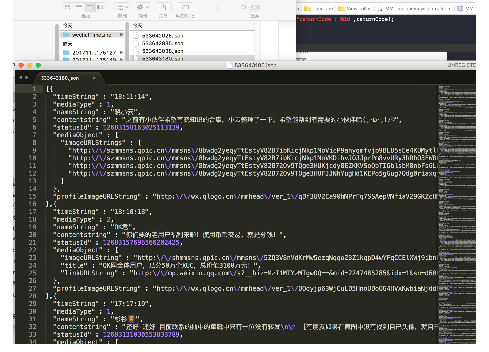

# WeChatPlugin - 浏览朋友圈&消息防撤回

Plugin For Mac WeChat.
 
## 提示

wechatplugin 仅限于个人爱好，技术研究，不用于商用，请大家遵守。如有纠纷，后果自负

## 说明

*  直接运行 WeChatPlugin.xcworkspace

## 版本演示

获取编译好的MAC微信方式

1. 关注“极限水果”公众号
2. 发送暗号: `我的朋友圈`
 

即可收到下载地址
TIPS: 打开注意，允许任何来源允许应用

* 打不开“XXX”，因为它来自身份不明的开发者
* 1.打开了 Terminal 终端后 ，在命令提示后输入
` sudo spctl --master-disable`

## 功能
* 导出朋友圈 
* 浏览朋友圈
* 自动登录  
* 消息自动回复
* 消息防撤回
* 远程控制
* 微信多开
* 第二次登录免认证
* 聊天置底功能(~~类似置顶~~)
* 微信窗口置顶
* 会话多选删除

#### 朋友圈

####  导出朋友圈到桌面

 
### 依赖

* [XMLReader](https://github.com/amarcadet/XMLReader)
* [insert_dylib](https://github.com/Tyilo/insert_dylib)

---
### Other

若有其他好的想法欢迎 Issue me

---
 

欢迎关注微信公众号👆
 
 
 
有钱任性赞赏码👆

